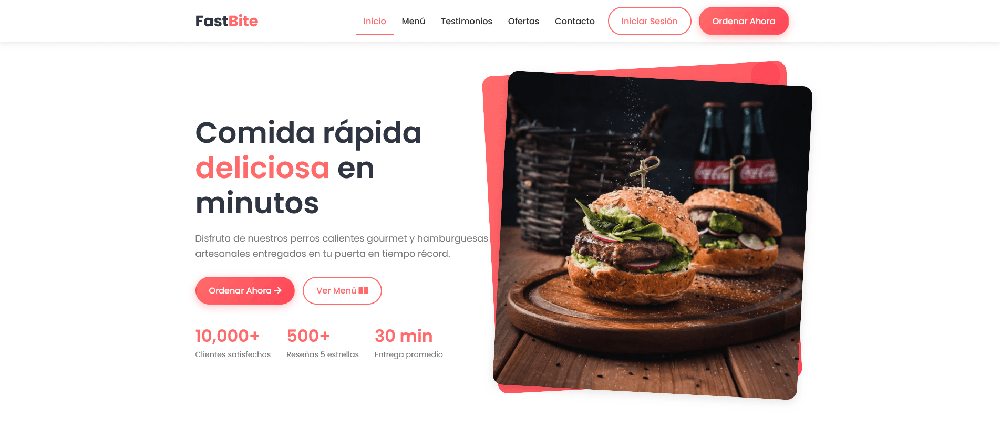
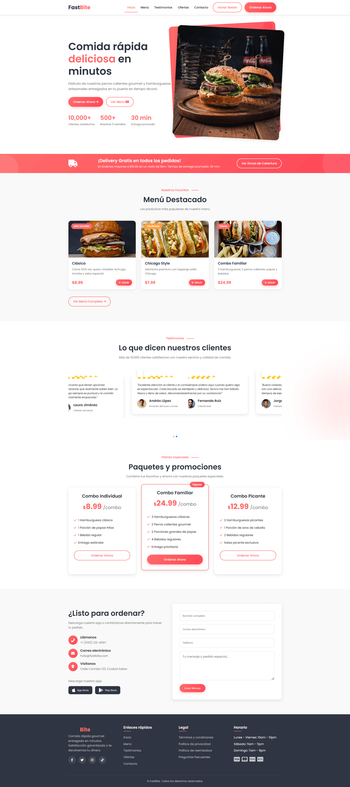
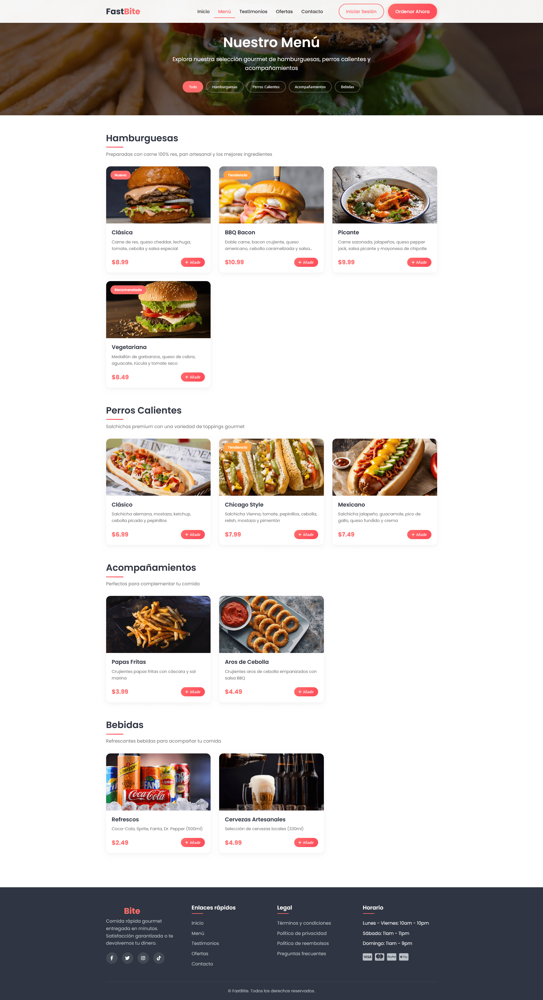
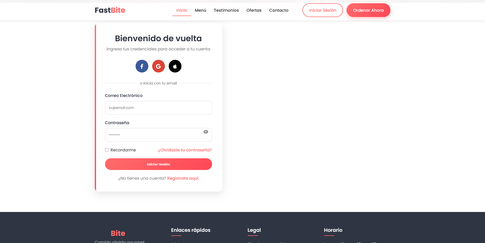

# Fast Bite - Sitio Web de Comida Rápida




Fast Bite es una sitio web moderna para un restaurante de comida rápida, con menú interactivo, sistema de login y diseño responsive.

## Características Principales
- Página de inicio con promociones destacadas
- Menú interactivo con categorías de productos
- Sistema de login para clientes
- Diseño responsive que funciona en móviles y desktop
- Galería de imágenes de productos

## Tecnologías Utilizadas
- HTML5
- CSS3
- JavaScript Vanilla
- Diseño responsive con Flexbox y Grid

## Cómo Ejecutar
1. Clonar el repositorio
2. Abrir `index.html` en tu navegador
3. Para ver el menú completo, abrir `menu.html`

## Estructura de Archivos
```
fast-bite/
├── index.html          # Página principal
├── login.html          # Página de login
├── menu.html           # Página de menú
├── assets/
│   ├── css/            # Estilos CSS
│   ├── js/             # Scripts JavaScript 
│   └── img/            # Imágenes del proyecto
└── preview/            # Capturas de pantalla
```

## Inicio


### Menu


### Login

